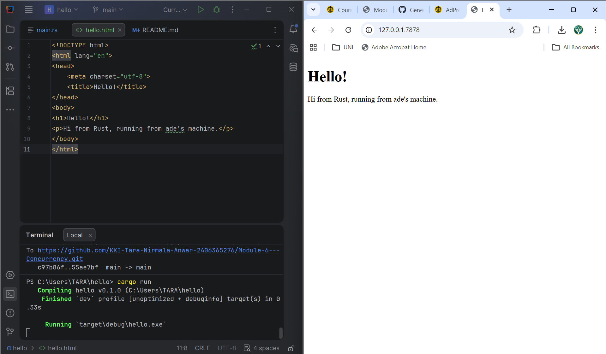
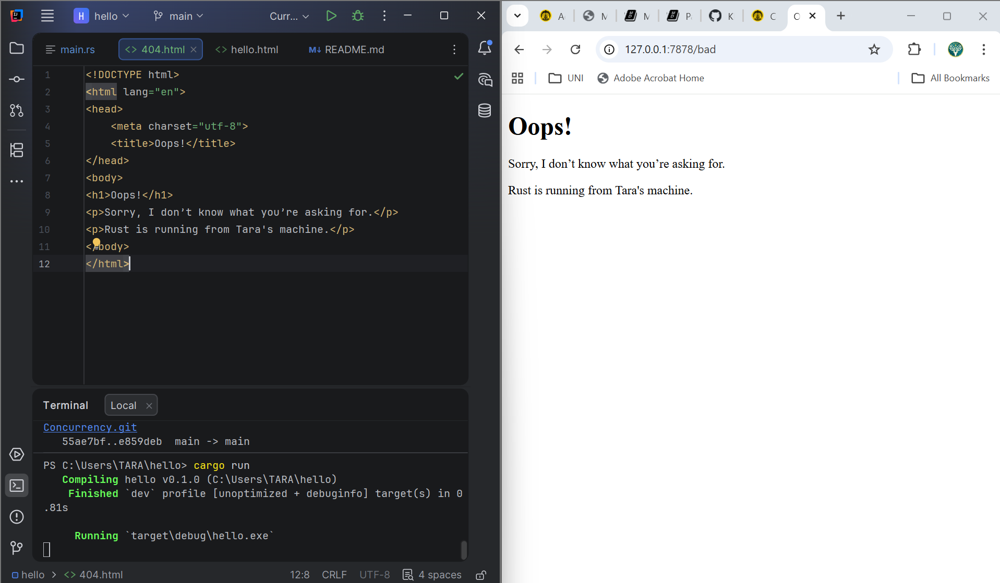

# Reflection Notes

## Commit 1 Reflection
In this step, I learned how to listen for TCP connections using TcpListener::bind("127.0.0.1:7878") and iterate over incoming connections. 
At first, the server only printed "Connection established!", so the browser did not display anything yet, but it showed that the program was already receiving requests.
Then I updated the code by adding handle_connection with TcpStream and BufReader. This helped me see the actual HTTP request sent by the browser.
From this part, I understood that the server first needs to read and understand the request before it can send back a proper response.

## Commit 2 Reflection
In this step, I modified the server to return an actual HTTP response instead of just printing the request. I learned that a valid HTTP response needs a status line, headers, and the body.
I used fs::read_to_string("hello.html") to read the HTML file and send it back to the browser. 
This made the browser finally display a real webpage instead of nothing.

## Commit 3 Reflection
In this step, I modified the server to respond differently based on the request. 
If the request is for the root path, it returns hello.html with 200 OK. 
Otherwise, it returns 404.html with 404 NOT FOUND.
This split is important because the server must handle valid and invalid requests differently. 
The refactoring is needed so the response is not always the same and becomes more realistic.
